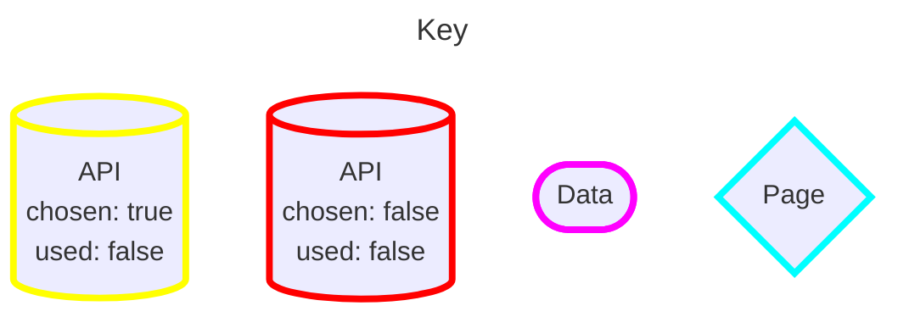
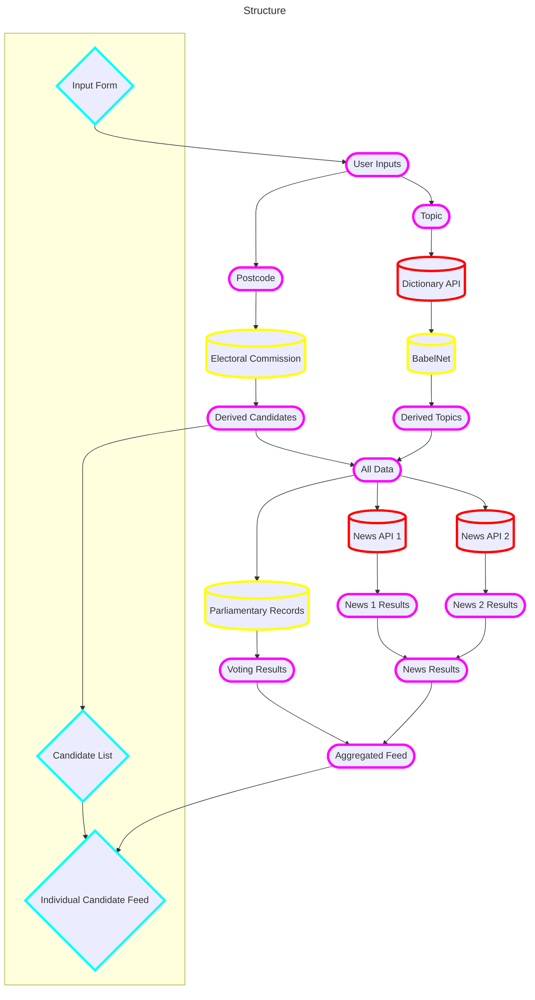
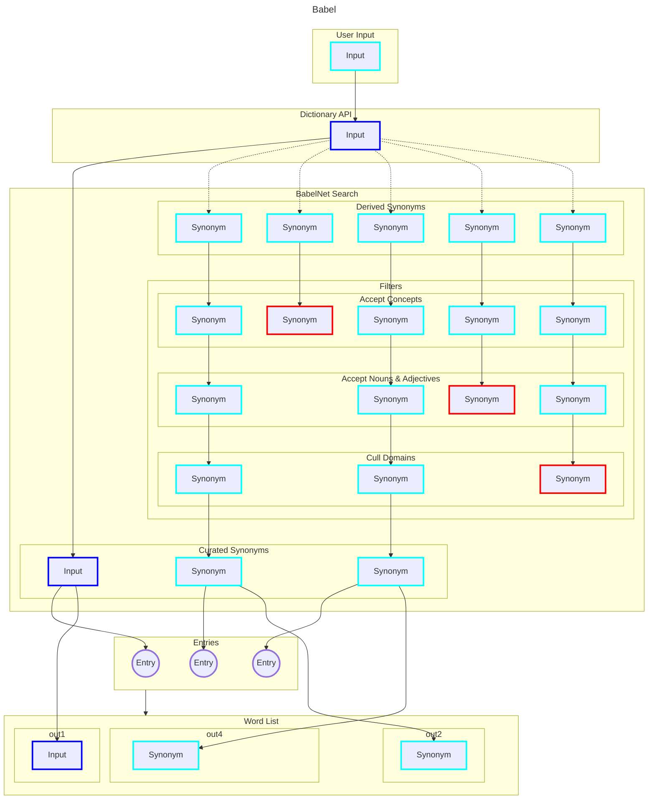
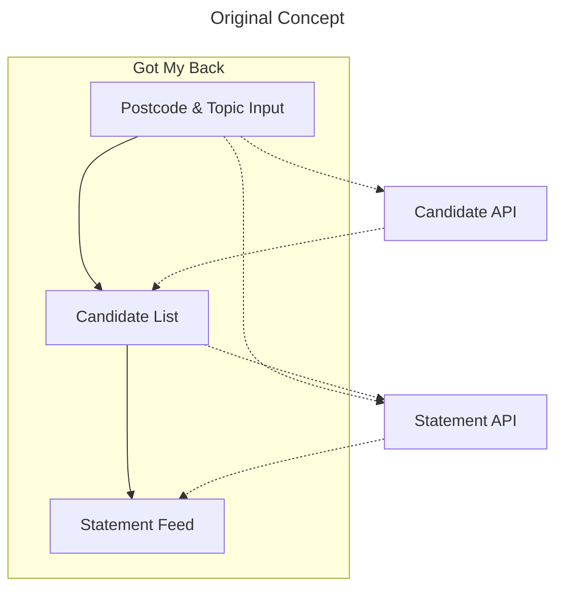

# App Flow Ideas

## To Add

- [ ] How we use Babel

## Current Plan

```mermaid
---
title: Key
---
    graph TD
    %% User Inputs
    apiUse[("`
        API
        chosen: true
        used: false
    `")]:::toUse
    apiFind[("`
        API
        chosen: false
        used: false
    `")]:::toFind
    dataFeed(["`
        Data
    `"]):::data
    gmbOne{"`
        Page
    `"}:::page

    %% Create Styles
    classDef toFind stroke:#f00, stroke-width:4px
    classDef toUse stroke:#ff0, stroke-width:4px
    classDef data stroke:#f0f, stroke-width:4px
    classDef page stroke:#0ff, stroke-width:4px
```

```mermaid
---
title: Structure
---
    graph TD
    %% User Inputs
    gmbSubmit{"`Input Form`"}:::page
    dataUser(["`User Inputs`"]):::data
    dataWhere(["`Postcode`"]):::data
    dataWhat(["`Topic`"]):::data

    %% User Inputs --> Expanded Inputs
    apiDic[("`Dictionary API`")]:::toFind
    apiBbl[("`BabelNet`")]:::toUse
    apiCom[("`Electoral Commission`")]:::toUse

    %% Expanded Inputs --> Search Terms
    dataTopic(["`Derived Topics`"]):::data
    dataWho(["`Derived Candidates`"]):::data
    dataTerms(["`All Data`"]):::data

    %% Search Terms --> Results
    apiPar[("`Parliamentary Records`")]:::toUse
    apiNew1[("`News API 1`")]:::toFind
    apiNew2[("`News API 2`")]:::toFind

    %% Results --> Data
    dataVote(["`Voting Results`"]):::data
    dataNews1(["`News 1 Results`"]):::data
    dataNews2(["`News 2 Results`"]):::data
    dataNews(["`News Results`"]):::data
    dataFeed(["`Aggregated Feed`"]):::data

    %% Data --> Output
    gmbAll{Candidate List}:::page
    gmbOne{Individual Candidate Feed}:::page

    %% Flow
    gmbSubmit --> dataUser
    dataUser --> dataWhere & dataWhat
    dataWhere --> apiCom
    dataWhat --> apiDic --> apiBbl
    apiCom --> dataWho
    apiBbl --> dataTopic
    dataWho --> dataTerms & gmbAll
    dataTopic --> dataTerms
    dataTerms --> apiPar & apiNew1 & apiNew2
    apiPar --> dataVote
    apiNew1 --> dataNews1
    apiNew2 --> dataNews2
    dataNews1 & dataNews2 --> dataNews
    dataNews & dataVote --> dataFeed
    dataFeed & gmbAll --> gmbOne

    subgraph user["`
    `"]
        gmbSubmit
        gmbAll
        gmbOne
    end

    %% Create Styles
    classDef toFind stroke:#f00, stroke-width:4px
    classDef toUse stroke:#ff0, stroke-width:4px
    classDef data stroke:#f0f, stroke-width:4px
    classDef page stroke:#0ff, stroke-width:4px
```

```mermaid
---
title: Babel
---
    graph TD
    subgraph inUse["`User Input`"]
        inUse1["`Input`"]:::isYes
    end

    inUse1 --> inDic1

    subgraph inDic["`Dictionary API`"]
        inDic1["`Input`"]:::isFin
    end

    inDic1 --> inSynCur1
        inDic1 -.-> inSynDer2
        inDic1 -.-> inSynDer3
        inDic1 -.-> inSynDer4
        inDic1 -.-> inSynDer5
        inDic1 -.-> inSynDer6

    subgraph inSyn["`BabelNet Search`"]
        subgraph inSynDer["`Derived Synonyms`"]
            inSynDer2["`Synonym`"]:::isYes
            inSynDer3["`Synonym`"]:::isYes
            inSynDer4["`Synonym`"]:::isYes
            inSynDer5["`Synonym`"]:::isYes
            inSynDer6["`Synonym`"]:::isYes
        end

        inSynDer2 --> inFilCon2
            inSynDer3 --> inFilCon3
            inSynDer4 --> inFilCon4
            inSynDer5 --> inFilCon5
            inSynDer6 --> inFilCon6

        subgraph inFil["`Filters`"]
            subgraph inFilCon["`Accept Concepts`"]
                inFilCon2["`Synonym`"]:::isYes
                inFilCon3["`Synonym`"]:::isNo
                inFilCon4["`Synonym`"]:::isYes
                inFilCon5["`Synonym`"]:::isYes
                inFilCon6["`Synonym`"]:::isYes
            end

            inFilCon2 --> inFilVer2
                inFilCon4 --> inFilVer4
                inFilCon5 --> inFilVer5
                inFilCon6 --> inFilVer6

            subgraph inFilVer["`Accept Nouns & Adjectives`"]
                inFilVer2["`Synonym`"]:::isYes
                inFilVer4["`Synonym`"]:::isYes
                inFilVer5["`Synonym`"]:::isNo
                inFilVer6["`Synonym`"]:::isYes
            end

            inFilVer2 --> inFilDom2
                inFilVer4 --> inFilDom4
                inFilVer6 --> inFilDom6

            subgraph inFilDom["`Cull Domains`"]
                inFilDom2["`Synonym`"]:::isYes
                inFilDom4["`Synonym`"]:::isYes
                inFilDom6["`Synonym`"]:::isNo
            end
        end

        inFilDom2 --> inSynCur2
            inFilDom4 --> inSynCur4

        subgraph inSynCur["`Curated Synonyms`"]
            inSynCur1["`Input`"]:::isFin
            inSynCur2["`Synonym`"]:::isYes
            inSynCur4["`Synonym`"]:::isYes
        end
    end

    inSynCur1 --> midHub1 & out1_1
        inSynCur2 --> midHub2 & out2_1
        inSynCur4 --> midHub4 & out4_1

    subgraph mid["`Entries`"]
        midHub1(("`Entry`"))
        midHub2(("`Entry`"))
        midHub4(("`Entry`"))
    end

    mid --> out

    subgraph out["`Word List`"]
        subgraph out1
            out1_1["`Input`"]:::isFin
        end
        
        subgraph out2
            out2_1["`Synonym`"]:::isYes
        end
        
        subgraph out4
            out4_1["`Synonym`"]:::isYes
        end
    end

    classDef default stroke-width:3px
    classDef isFin stroke:#00f
    classDef isYes stroke:#0ff
    classDef isNo stroke:#f00
```

## Archive

```mermaid
---
title: Original Concept
---
    graph TD

    subgraph gmb["Got My Back"]
        userIn["Postcode & Topic Input"]
        canList["Candidate List"]
        deedList["Statement Feed"]
    end

    canApi["Candidate API"]
    deedApi["Statement API"]

    userIn --> canList --> deedList

    userIn -.-> canApi & deedApi
    canApi -.-> canList
    canList -.-> deedApi
    deedApi -.-> deedList
```
