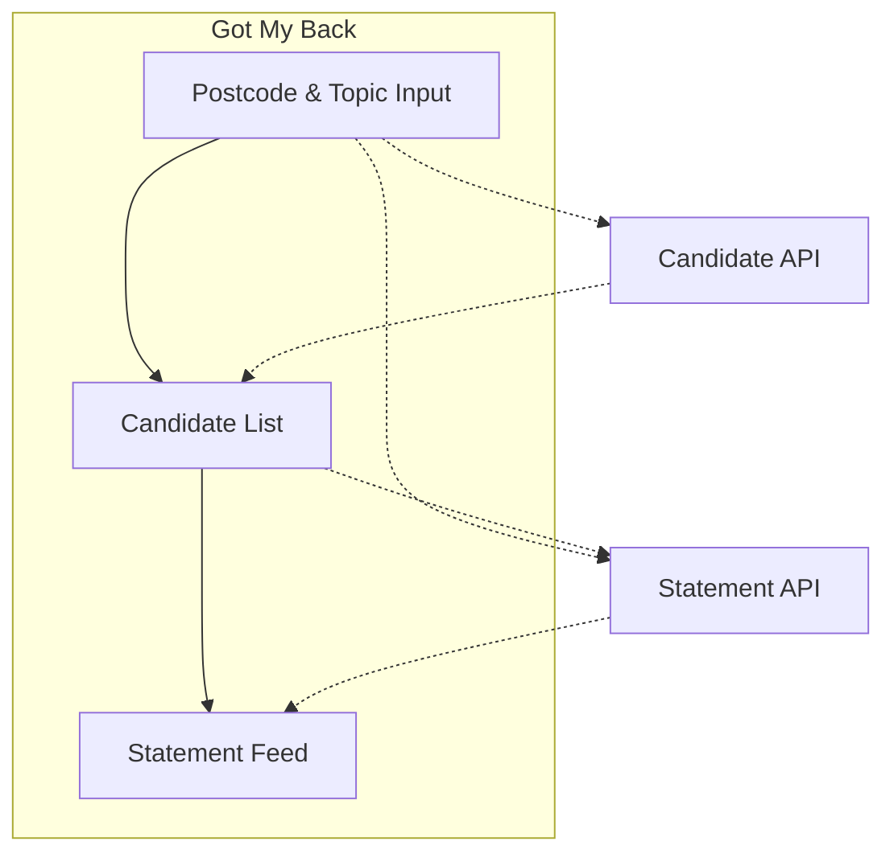

# App Flow Ideas

```mermaid
graph TD

subgraph gmb["Got My Back"]
    userIn["Postcode & Topic Input"]
    canList["Candidate List"]
    deedList["Statement Feed"]
end

canApi["Candidate API"]
deedApi["Statement API"]

userIn --> canList --> deedList

userIn -.-> canApi & deedApi
canApi -.-> canList
canList -.-> deedApi
deedApi -.-> deedList
```
